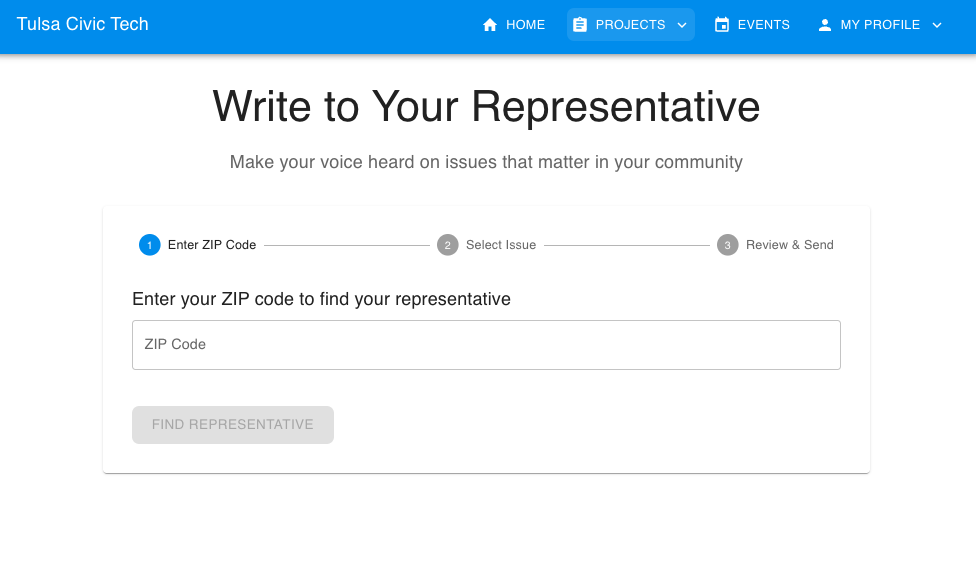

# Tulsa Civic Connect 🏛️

An AI-powered civic engagement platform that empowers Tulsa residents to participate in local democracy through interactive learning and meaningful action.

## 🎯 Overview

Tulsa Civic Connect combines artificial intelligence with gamified learning to help citizens:
- Understand local issues affecting Tulsa
- Learn about candidates and upcoming elections
- Engage with local government processes
- Take action on issues they care about

Developed in partnership with Leadership Tulsa, this platform makes civic engagement accessible and engaging for all Tulsa residents.

## 🛠️ Quick Setup

1. **Prerequisites**
   - Node.js 16.x or higher
   - MongoDB 4.4+
   - OpenAI API key

2. **Installation**
```bash
# Clone the repository
git clone https://github.com/your-org/tulsa-civic-connect.git

# Navigate to project directory
cd tulsa-civic-connect

# Install dependencies
npm install

# Set up environment variables
cp .env.example .env
```

3. **Configuration**
   Edit `.env` with your credentials:
```bash
OPENAI_API_KEY=your_api_key
MONGODB_URI=your_mongodb_uri
JWT_SECRET=your_jwt_secret
```

4. **Start Development**
```bash
# Run all services
npm run dev:all

# Or run frontend only
npm run dev
```

Visit `http://localhost:3000` to view the application.


*The learning dashboard tracks your progress through civic engagement modules and rewards consistent participation*

## ✨ Key Features

### 🤖 AI Chatbot Assistant
- Have natural conversations about Tulsa's local issues
- Get unbiased information about candidates and elections
- Learn about current bills and legislation
- Understand how local government works

### 📚 Interactive Learning
- Curriculum developed by Leadership Tulsa experts
- Gamified modules on civic engagement
- Progress tracking and achievements
- Real-world civic action challenges


*Earn badges and track your progress as you become a Civic Champion! Join district teams and complete learning paths to level up your civic engagement.*

### ✍️ Letter Generator
- Easy-to-use tool for contacting elected officials
- Pre-formatted templates for different issues
- Personalization assistance
- Direct delivery to representatives



*Our AI-powered letter writer helps you craft effective messages to your representatives while maintaining your authentic voice*

### 🗳️ Voter Resources
- Election calendar and reminders
- Candidate profiles and comparisons
- Voting location finder
- Registration status checker

## 🏗️ Project Structure

```
tulsa-civic-connect/
├── src/
│   ├── components/     # Reusable UI components
│   ├── pages/         # Next.js pages and routes
│   ├── styles/        # Global styles and themes
│   ├── utils/         # Helper functions and utilities
│   └── api/          # API routes and handlers
├── public/           # Static assets
└── tests/           # Test suites
```

## 🧪 Testing

```bash
# Run all tests
npm test

# Run tests in watch mode
npm run test:watch
```

## 🛠️ Technologies

- Next.js
- OpenAI API
- MongoDB
- Node.js
- Express

## 🤝 Contributing

We welcome contributions from the community! Please read our [Contributing Guidelines](CONTRIBUTING.md) for details on how to submit pull requests, report issues, and contribute to the project.

## 📄 License

This project is licensed under the MIT License - see the [LICENSE](LICENSE) file for details.

## 🙏 Acknowledgments

- Leadership Tulsa for curriculum development and expertise
- City of Tulsa for data and resources
- Local community partners and beta testers

## 📞 Contact

For questions or support, please reach out to [contact@tulsacivicconnect.org](mailto:contact@tulsacivicconnect.org)

## 🔄 Updates and Versioning

- We use [Semantic Versioning](https://semver.org/)
- See [CHANGELOG.md](CHANGELOG.md) for version history
- Main branch is our production-ready code

---


Built with ❤️ for Tulsa's civic future