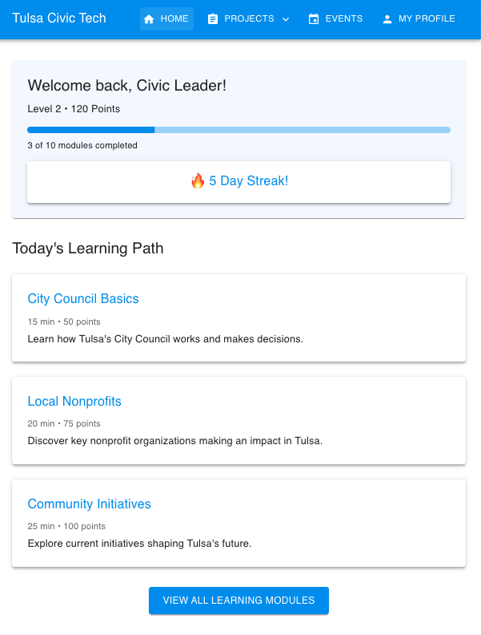
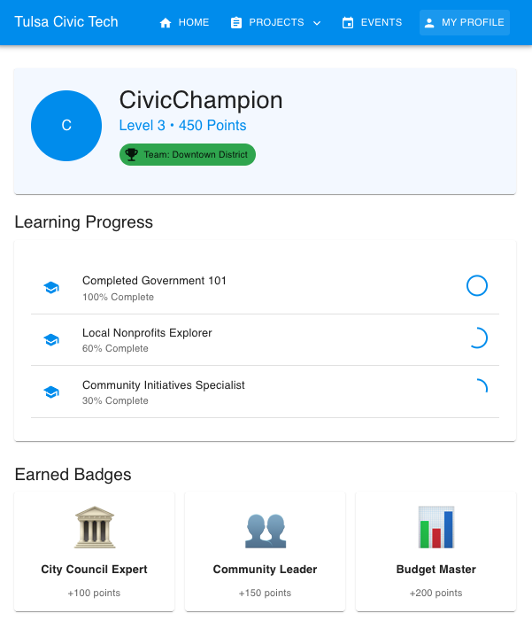

# Tulsa Civic Connect 🏛️

An AI-powered civic engagement platform that empowers Tulsa residents to participate in local democracy through interactive learning and meaningful action.

## 🎯 Overview

Tulsa Civic Connect combines artificial intelligence with gamified learning to help citizens:
- Understand local issues affecting Tulsa
- Learn about candidates and upcoming elections
- Engage with local government processes
- Take action on issues they care about

Developed in partnership with Leadership Tulsa, this platform makes civic engagement accessible and engaging for all Tulsa residents.



*The learning dashboard tracks your progress through civic engagement modules and rewards consistent participation*

## ✨ Key Features

### 🤖 AI Chatbot Assistant
- Have natural conversations about Tulsa's local issues
- Get unbiased information about candidates and elections
- Learn about current bills and legislation
- Understand how local government works

### 📚 Interactive Learning
- Curriculum developed by Leadership Tulsa experts
- Gamified modules on civic engagement
- Progress tracking and achievements
- Real-world civic action challenges



*Earn badges and track your progress as you become a Civic Champion! Join district teams and complete learning paths to level up your civic engagement.*

### ✍️ Letter Generator
- Easy-to-use tool for contacting elected officials
- Pre-formatted templates for different issues
- Personalization assistance
- Direct delivery to representatives

### 🗳️ Voter Resources
- Election calendar and reminders
- Candidate profiles and comparisons
- Voting location finder
- Registration status checker

## 🚀 Getting Started

1. Clone the repository
2. Install dependencies:
```

## 🛠️ Technologies

- Next.js
- OpenAI API
- MongoDB
- Node.js
- Express

## 🤝 Contributing

We welcome contributions from the community! Please read our [Contributing Guidelines](CONTRIBUTING.md) for details on how to submit pull requests, report issues, and contribute to the project.

## 📄 License

This project is licensed under the MIT License - see the [LICENSE](LICENSE) file for details.

## 🙏 Acknowledgments

- Leadership Tulsa for curriculum development and expertise
- City of Tulsa for data and resources
- Local community partners and beta testers

## 📞 Contact

For questions or support, please reach out to [contact@tulsacivicconnect.org](mailto:contact@tulsacivicconnect.org)

---

Built with ❤️ for Tulsa's civic future